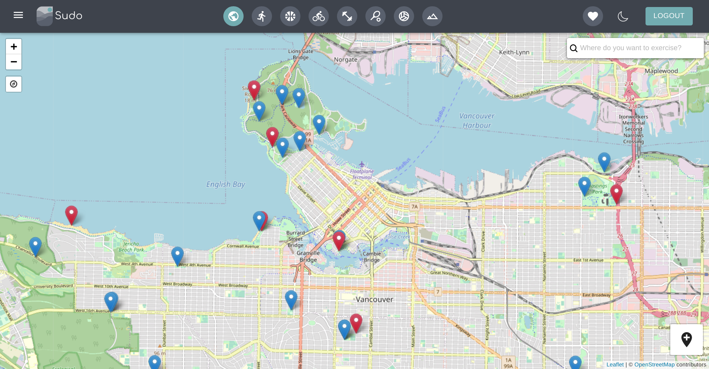
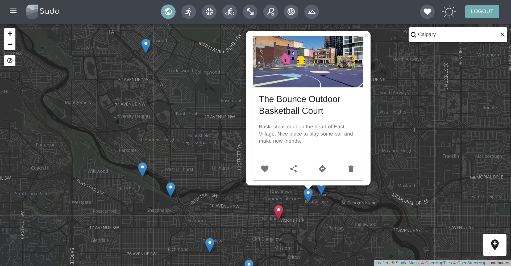

Sudo
=========

## Description

 Community-driven platform to find the best outdoor fitness and sports areas in your city. Sudo was made as a final project for the Lighthouse Labs Web Development Bootcamp by [Eric Bennett](https://github.com/ericos-bennett), [Bruno Verissimo](https://github.com/brunomveri), and [Luke Oloffs](https://github.com/loloffs).

Sudo is hosted and available for anyone to use via Heroku at: https://sudo-fitness.herokuapp.com/


 
 ### Main Screen


### Dark theme and location popup



## Features

1. Discover outdoor workout locations with geolocation or search
2. Create or delete workout locations
3. Favourite locations
4. Filter locations by favourited or activity type
5. Get directios via Google Maps button in location popup


## Tech Stack

- React v16.8
- Ruby v2.6
- Rails v5.2
- Leaflet and plugins
- Material UI
- PostgreSQL

## Getting Started

- Run ```bundle install``` from root directory to install Rails dependencies
- Run the Rails server with ```rails s -b 0.0.0.0 -p 3001``` in root directory
- Install all dependencies with ```npm install``` in client folder
- Run the React Development Server with ```npm start``` in client folder
